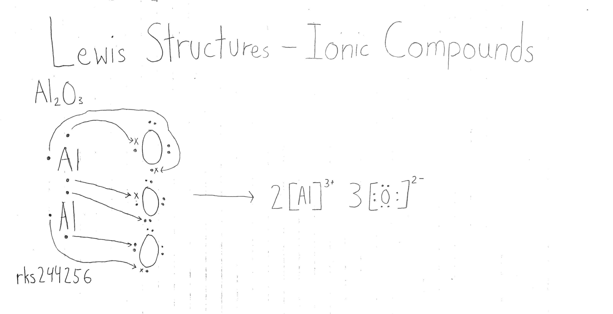
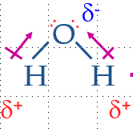
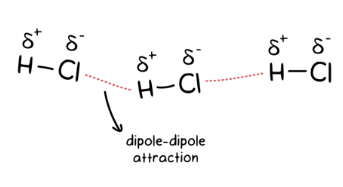
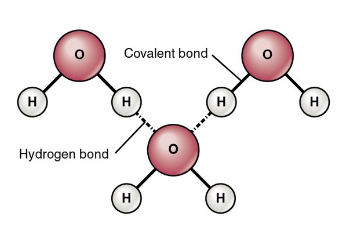

## Chemistry Review/Prerequisites

## Intramolecular Bonding

The bonds within a molecule. Essentially the forces which hold a molecule together.

### Why?

Molecules form bonds in order to fulfill the *octet rule*. 
#### Octet Rule

Main group elements tend to bond in a way where they have full valence shells (hence the coined term octet rule)
### Ionic Bonding

Ionic bonds are between a **metal** and **non-metal**. This type of intramolecular bonding involves the metal losing one or more electron(s) and the non-metal gaining *n* amount of electrons from the metal. 

### Covalent Bonding

Covalent bonding occurs between 2 or more non-metals. Rather than the transfer of electrons like in *ionic bonding*, electrons are shared. Atoms can either form single, double, or triple bonds. Electrons involved in this processed are called **bonding pairs**.

#### Types of Covalent Bonds

**Non-Polar Covalent Bonds** are two atoms which equally share electrons.

**Polar Covalent Bonds** are two atoms which share electrons unequally. Electrons will be pulled towards the more electronegative atom causing the resulting molecule to form positive and negative sides which allows it to interact with other molecules.

### Ionic vs Covalent

| Bond     | General Properties                                                                                                 |
| -------- | ------------------------------------------------------------------------------------------------------------------ |
| Ionic    | Forms crystalline solids High melting & boiling points Hard & brittle Soluble Conducts electricity  |
| Covalent | Soft & squishy relative to ionic compounds Lower melting & boiling points Insoluble Not conductive        |
## Intermolecular Forces

*Intermolecular forces* refer to forces which occur between molecules. Also known as **van der Waals forces**.

These are weaker than intramolecular bonds.
### Dipole-Dipole

Dipole-dipole refers to intermolecular forces which hold polar molecules together.

A partial +ve charge of a molecule is electrostatically attracted to the partial -ve charge of a neighbor molecule. (Opposites attract) These charges are of course formed from *polar covalent bonds*. 

### Hydrogen Bonding

*Hydrogen bonds* are a stronger type of dipole-dipole bonds which only occur between Hydrogen *(H)* and Oxygen *(O)*, Nitrogen *(N)*, or Fluorine *(F)*. 

*Hydrogen bonds* are the strongest intermolecular force as Hydrogen has a small nucleus and is positively charged and Oxygen, Nitrogen, and Fluorine are very electronegative which combined, create a strong attraction.

They are easily created and easily broken.

### London Dispersion Forces

The weakest of bonds. It exists between all atoms and molecules but is more significant in *non-polar molecules*.

Electrons are constantly moving within an atom/molecule. As such, one side will be slightly more negative than the other. This can and will switch to a positive charge only an instant later, attracting another molecule.

### Review PDF

## Biochemistry

### Types of Biological Molecules

There are 5 types of biological molecules:

| Molecule      | Type      | Notes                                                            |
| ------------- | --------- | ---------------------------------------------------------------- |
| Water         | Inorganic | Despite not being a macromolecule, it's still essential to life. |
| Proteins      | Organic   |                                                                  |
| Carbohydrates | Organic   |                                                                  |
| Nucleic Acids | Organic   |                                                                  |
| Lipids        | Organic   |                                                                  |
#### Organic vs Inorganic Compounds

**Organic compounds** contain **Carbon** and **Hydrogen** along with other atoms such as Oxygen, Sulfur, Nitrogen, and Phosphorus.

**Inorganic compounds** lack Carbon and/or Hydrogen and are therefore not *organic*.

#### Molecule Structures

The function of a molecule is determined by its structure. This structure is determined by the **bonds between atoms** and the **overall shape of the molecule**. These unique structures are also called **isomers**.

**Note:** The bonds between organic molecules will often as reservoirs of energy. This is especially true for bonds between **Carbon** and **Hydrogen**.

### Functional Groups

Biochemically significant molecules only contain **carbon**, **hydrogen**, **oxygen**, **nitrogen**, **sulfur**, & **phosphorus**.

#### Hydrocarbons

Essentially, the base molecule is called a **hydrocarbon**. These molecules only contain *carbon* & *hydrogen* and end with "*ane*". These molecules are biologically unreactive.

##### Saturated Hydrocarbons

Saturated hydrocarbons are stable and unreactive. This  molecule contains carbon atoms with hydrogen atoms bonded to it. All covalent bonds are single and these molecules have the maximum number of hydrogen atoms possible.

#### Functional Groups

Organic compounds are made of **carbon** with functional groups attached in order to make them reactive and useful. Functional groups play an important role in the structure and function of a molecule. 

They can determine the features and characteristics of a molecule (for example, aminos can make a molecule more basic whereas carboxy groups can make a molecule more acidic.)

Majority of the chemical reactions within an organism involve the transfer of these functional groups to another molecule.

Common functional groups include:

| Group      | Chemical Formula | Structural Formula                                                         | Found In:                    | Comments                                                                                                                                                                                                              |
| ---------- | ---------------- | -------------------------------------------------------------------------- | ---------------------------- | --------------------------------------------------------------------------------------------------------------------------------------------------------------------------------------------------------------------- |
| Hydroxyl   | OH               |                  | Alcohols                     | Organic molecules with hydroxyl groups are **alcohol**.  Due to making hydrocarbon polar, it makes the molecule in question more soluble.                                                                       |
| Carboxyl   | COOH             |      | Acids                        | Organic molecules with carboxyl are called **carboxylic acids** as it releases *hydrogen* when dissolved.  One of the carbon's valence electrons is free which opens the possibility to form a larger molecule. |
| Amino      | NH2   |            | Bases                        | Organic molecules with **amino** are called **amines**.  Amines are weak bases due to pulling *hydrogen* from solutions.  Amino is present in all amino acids.                                            |
| Sulfhydryl | SH               |  | Rubber                       |                                                                                                                                                                                                                       |
| Phosphate  | PO4   |    | ATP (Adenosine Triphosphate) | Organic molecules with **phosphate** are called **organic phosphates**.  Phosphate is one of the 3 components of nucleotides (DNA and ATP) and are attached to proteins and other biological molecules.         |
*R is shorthand for a hydrocarbon*

#### Functional Groups PDF

### Water

Water molecules are polar covalent and is a dipole (slight negative charge on the *oxygen* and positive charge on the *hydrogen*).

#### Like Dissolves Like?

Polar dissolves polar

Nonpolar dissolves non-polar

If two substances dissolve, it's considered soluble and both are like.

#### Relevance?

Water is referred to as the universal solvent because of its polarity.

#### Properties of Water

| Properties             | Description                                                                                                                                         | Importance                                                                                               |
| ---------------------- | --------------------------------------------------------------------------------------------------------------------------------------------------- | -------------------------------------------------------------------------------------------------------- |
| Adhesion               | Water sticks to other substances quite well                                                                                                         | Allows water transport through blood and the xylem                                                       |
| Cohesion               | Water molecules can bond with other water molecules via *hydrogen bonds*                                                                            | Further aids water transport                                                                             |
| Surface Tension        | Allows water to resist external force. Water has a high surface tension.                                                                            | Allows insects and animals to walk on water                                                              |
| Solvent Properties     | Water is considered the universal solvent and is able to dissolve other molecules.                                                                  | This is important for bodily functions (such as kidney functions)                                        |
| Density                | Water, rather than contracting and becoming more dense when frozen, does the opposite. The hydrogen bonds freeze and molecules become farther away. | Allows fish and other aquatic life to survive under the surface of the water.                            |
| Specific Heat Capacity | Water has a specific heat capacity which means it requires a large amount of heat to raise its temperature.                                         | Allows fish and other aquatic life to acclimate in a stable temperature with minimal to no fluctuations. |
### Macromolecules

**Macromolecules** are large molecules which are made up of repeating **subunits** and is often considered a **polymer** (the subunit being a **monomer**)

There are 4 main macromolecules.

| Macromolecule | Monomer Unit           |
| ------------- | ---------------------- |
| Carbohydrates | Monosaccharides        |
| Lipids/Fats   | Fatty Acids & Glycerol |
| Proteins      | Amino Acids            |
| Nucleic Acids | Nucleotides            |
#### Forming Macromolecules

Macromolecules are formed using reactions between functional groups using their monomer units. The subunits join together with the help of their functional groups and in the process, a water molecule is removed.

**Dehydration synthesis** is the anabolic reaction which absorbs energy and forms a polymer.

#### Breaking Apart Macromolecules

Macromolecules can be broken apart using addition reactions where the polymer is broken into it's monomers by adding a water molecule. 

This process is known as **hydrolysis** and is a catabolic reaction which releases energy. 

#### Macromolecules PDF

### Cell Membrane & Transport

#### Cell Membrane & Transport PDF

#### Amoeba Sisters Cell Transport Summary PDF

Video: https://www.youtube.com/watch?v=Ptmlvtei8hw

#### Phospholipid Diagram PDF

### Enzymes

#### Enzyme PDF

### Biochemistry Review Sheet

## Molecular Genetics

### DNA & DNA Replication

#### Telomerase

### Protein Synthesis

